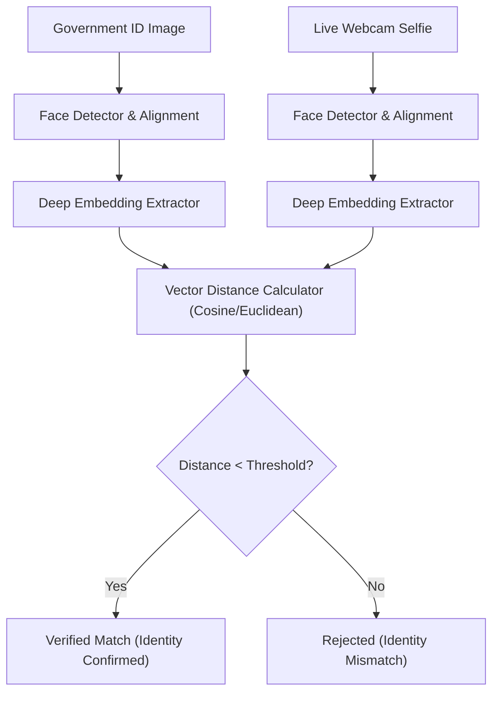
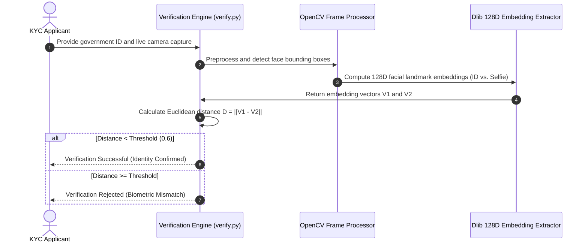

# FaceVerify — Biometric Face Recognition & Verification System
[]()
[]()
[]()
[]()

## Overview
FaceVerify is an automated facial recognition, identity verification, and biometric matching engine implemented in Python using OpenCV, facial landmark detection, and deep metric embeddings. The system processes identity card captures and live camera selfies to verify matching facial identity with high precision.

- **Problem Solved:** Remote identity proofing and biometric fraud prevention for automated KYC workflows.
- **Target Users:** FinTech identity verification, attendance systems, and physical security gateways.
- **Current Status:** Functional Python Biometric Pipeline.

## Features
- **Facial Landmark Detection:** Identifies 68-point facial landmarks for pose normalization.
- **128D Face Embeddings:** Generates deep metric embedding vectors for facial comparisons.
- **Euclidean / Cosine Matching:** Computes distance metrics with configurable acceptance thresholds.
- **Automated CI Workflow:** GitHub Actions configuration for continuous testing of verification logic.

## Architecture


## User Flow


## Technology Stack
| Layer | Technology | Purpose |
|---|---|---|
| Core Language | Python 3.10+ | Biometric pipeline execution |
| Computer Vision | OpenCV (cv2) | Image preprocessing, cropping, and color conversion |
| Deep Learning | Dlib / face_recognition / NumPy | Face detection and landmark embeddings |
| CI/CD | GitHub Actions | Automated build and test pipeline |

## Infrastructure
- **Runtime:** Python virtual environment
- **CI Pipeline:** `.github/workflows/python-app.yml`

## Project Structure
```text
faceverify/
├── data/
│   ├── encodings/       # Serialized facial embeddings (.gitkeep)
│   ├── ids/             # Input reference ID images (.gitkeep)
│   └── selfies/         # Live camera captures (.gitkeep)
├── logs/                # Audit verification logs (.gitkeep)
├── .github/workflows/   # python-app.yml CI definition
├── requirements.txt     # Python dependencies
├── .env.example         # Environment template
├── .gitignore           # Git ignore definitions
└── README.md            # Technical documentation
```

## Prerequisites
- Python >= 3.10
- CMake and C++ build tools (required for Dlib compilation)
- Webcam (for live verification capture)

## Environment Variables
Create `.env` using placeholders:
```env
MATCH_THRESHOLD=0.6
LOG_LEVEL=INFO
DATA_DIR=./data
```

## Local Development Setup
1. Clone the repository:
   ```bash
   git clone https://github.com/Bhanutejanallamothu/faceverify.git
   cd faceverify
   ```
2. Create and activate a virtual environment:
   ```bash
   python -m venv venv
   source venv/bin/activate  # On Windows: venv\Scripts\activate
   ```
3. Install dependencies:
   ```bash
   pip install -r requirements.txt
   ```
4. Run face verification pipeline:
   ```bash
   python verify.py --id data/ids/sample_id.jpg --selfie data/selfies/sample_selfie.jpg
   ```

## Docker Setup
*Not detected in repository. Docker container with OpenCV and CMake base image recommended.*

## Database Setup
*Not applicable. Embeddings are stored as serialized NumPy arrays or pickle caches.*

## API Documentation
*Command-line interface with programmatic Python API (`verify_faces(img1, img2)`).*

## Deployment
Deployable as a microservice worker on AWS ECS or GCP Cloud Run.

## Security
- Raw biometric images should be encrypted at rest and in transit.
- Anti-spoofing and liveness detection should be enabled in production.

## Testing
Run test verification suite:
```bash
pytest tests/
```

## Troubleshooting
- **Dlib Install Fails on Windows:** Ensure Visual Studio C++ Build Tools with CMake are installed before `pip install dlib`.

## Future Improvements
- Liveness detection via blink and head movement tracking.
- Web API wrapper using FastAPI.

## License
No formal open-source license provided. All rights reserved by repository owner.
